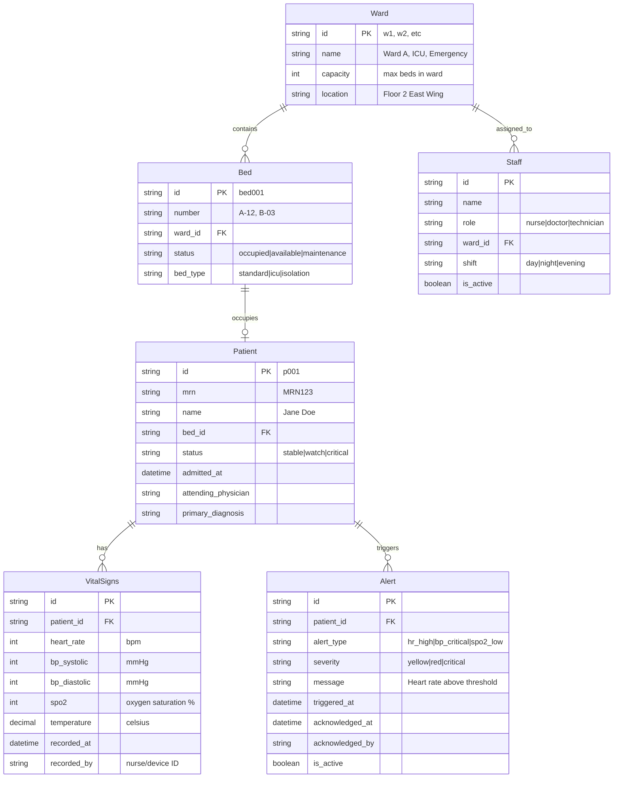

# Hospital Dashboard ERD Design

## Entity Relationship Diagram

## Relationship Design Decisions

### Ward → Bed (One-to-Many)
**Rationale:** Each ward contains multiple beds, but each bed belongs to only one ward. This supports ward-based filtering and capacity management.

### Bed → Patient (One-to-Zero-or-One) 
**Rationale:** A bed can be empty or occupied by exactly one patient. Patients can be transferred between beds, so we track current bed assignment rather than a many-to-many relationship.

### Patient → VitalSigns (One-to-Many)
**Rationale:** Each patient has multiple vital sign readings over time (every few minutes). This supports trend analysis and historical data for the sparkline charts and modal trend graphs.

### Patient → Alert (One-to-Many)
**Rationale:** A patient can trigger multiple alerts (e.g., high heart rate AND low oxygen). Each alert is independent and can be acknowledged separately.

### Ward → Staff (One-to-Many)
**Rationale:** Staff are typically assigned to specific wards for accountability and workflow optimization. Supports showing who's responsible for monitoring alerts.

## Key Design Considerations

### Time-Series Data (VitalSigns)
- `recorded_at` timestamp is crucial for real-time updates and trend analysis
- `recorded_by` tracks data source (manual entry vs automated device)
- No cascading deletes - vital signs are kept for historical analysis even if patient is discharged

### Alert Management
- `is_active` flag allows alerts to be resolved without deletion
- `acknowledged_at`/`acknowledged_by` tracks staff response for accountability
- `severity` drives the color-coding in the UI (red/yellow/green)

### Real-time Considerations
- Patient status changes trigger SignalR broadcasts
- VitalSigns updates broadcast to ward-specific groups
- Alert creation/acknowledgment broadcasts immediately

### Business Rules Enforced
1. **Bed Occupancy:** Only one active patient per bed
2. **Alert Thresholds:** Configurable per patient or ward-level defaults  
3. **Data Retention:** VitalSigns retained indefinitely for trend analysis
4. **Staff Assignment:** Staff can be assigned to multiple wards but have a primary ward

## Data Flows for Real-time Updates

### Vital Signs Update Flow:
1. New VitalSigns record created
2. Alert thresholds evaluated → potential Alert creation
3. Patient status updated if critical
4. SignalR broadcast: `vitals:update` to ward group
5. UI updates patient row and sparkline in real-time

### Alert Flow:
1. VitalSigns triggers threshold breach
2. Alert record created with severity
3. SignalR broadcast: `alert:new` to ward staff
4. UI shows alert badge and plays notification sound
5. Staff acknowledgment updates Alert.acknowledged_at

This ERD supports the real-time dashboard requirements while maintaining data integrity and supporting future features like staff management and detailed patient history.